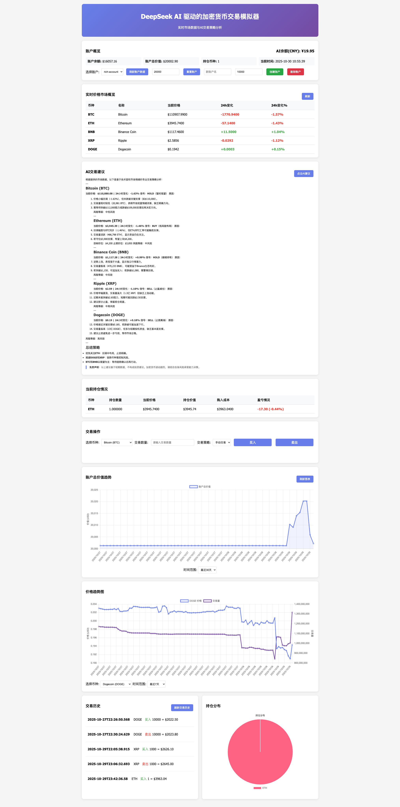

# DeepSeek AI 驱动的加密货币交易模拟系统

一个基于DeepSeek AI的加密货币交易模拟器，允许用户测试交易策略并模拟真实市场条件下的交易。


## 功能特点

- 实时加密货币市场数据获取--------市场获取的币安的数据 国内可能访问不了 走代理可以的
- DeepSeek AI 驱动的交易策略分析
- 模拟交易执行和账户管理
- 交易历史记录和性能分析
- 可视化图表展示
- 支持多币种交易（Bitcoin, Ethereum, Binance Coin, Solana, Ripple, Dogecoin）
- 定时数据更新（每30分钟自动获取最新市场数据）
- 北京时间显示支持
- 账户总价值历史追踪
- 持仓分布可视化
- 价格趋势图分析

## 技术栈

- **后端框架**: Spring Boot 2.7.18
- **前端技术**: HTML5, CSS3, JavaScript, Chart.js
- **数据库**: MySQL 8.0+
- **AI服务**: DeepSeek API
- **市场数据**: Binance API
- **构建工具**: Maven 3.6+
- **Java版本**: JDK 8+

## 系统架构

```
┌─────────────────┐    ┌──────────────────┐    ┌──────────────────┐
│   前端界面      │◄──►│   API服务层      │◄──►│   数据存储层     │
│  (Thymeleaf)    │    │  (Controllers)   │    │   (MySQL数据库)  │
└─────────────────┘    └──────────────────┘    └──────────────────┘
                              │                         ▲
                              ▼                         │
                    ┌──────────────────┐               │
                    │   业务逻辑层     │◄──────────────┘
                    │  (Services)      │    外部API调用
                    └──────────────────┘    (Binance API)
                              │
                              ▼
                    ┌──────────────────┐
                    │   AI分析服务     │
                    │  (DeepSeek API)  │
                    └──────────────────┘
```

## 安装和设置

### 环境要求

- Java JDK 8 或更高版本
- Maven 3.6 或更高版本
- MySQL 8.0 或更高版本
- 网络连接（用于访问Binance API和DeepSeek AI API）

### 安装步骤

1. 克隆项目代码:
   ```bash
   git clone <repository-url>
   cd noodle-deepseek-ai-trade-coin
   ```

2. 配置数据库:
   - 创建MySQL数据库
   - 在 `src/main/resources/application.yml` 中配置数据库连接信息

3. 配置DeepSeek API密钥:
   - 在 `src/main/resources/application.yml` 中配置API密钥，或
   - 通过环境变量 `DEEPSEEK_API_KEY` 设置

4. 配置Binance API密钥（可选，用于真实交易）:
   - 在 `src/main/resources/application.yml` 中配置API密钥，或
   - 通过环境变量 `BINANCE_API_KEY` 和 `BINANCE_SECRET_KEY` 设置

5. 编译项目:
   ```bash
   mvn clean compile
   ```

6. 运行项目:
   ```bash
   mvn spring-boot:run
   ```

7. 访问应用:
   打开浏览器访问 `http://localhost:8083`

## 配置说明

### 数据库配置
在 `src/main/resources/application.yml` 中配置MySQL数据库连接:

```yaml
spring:
  datasource:
    url: jdbc:mysql://localhost:3306/your_database_name?useSSL=false&serverTimezone=Asia/Shanghai
    username: your_username
    password: your_password
    driver-class-name: com.mysql.cj.jdbc.Driver
```

### DeepSeek AI 配置
在 `src/main/resources/application.yml` 中配置DeepSeek AI:

```yaml
# DeepSeek AI 配置
deepseek:
  api:
    key: ${DEEPSEEK_API_KEY:sk-1}  # 默认值为sk-1，生产环境应通过环境变量设置
    url: https://api.deepseek.com/v1
    model: deepseek-chat
```

可以通过以下方式设置API密钥：
1. 修改配置文件中的默认值
2. 设置环境变量: `export DEEPSEEK_API_KEY=your_actual_api_key`
3. 在启动时通过JVM参数传递: `-DDEEPSEEK_API_KEY=your_actual_api_key`

### Binance API 配置
在 `src/main/resources/application.yml` 中配置Binance API（用于真实交易）:

```yaml
# Binance API 配置
binance:
  api:
    key: ${BINANCE_API_KEY:}  # Binance API Key，生产环境应通过环境变量设置
    secret: ${BINANCE_SECRET_KEY:}  # Binance Secret Key，生产环境应通过环境变量设置
    url: https://api.binance.com
```

可以通过以下方式设置API密钥：
1. 修改配置文件中的默认值
2. 设置环境变量: 
   ```bash
   export BINANCE_API_KEY=your_binance_api_key
   export BINANCE_SECRET_KEY=your_binance_secret_key
   ```
3. 在启动时通过JVM参数传递: 
   `-DBINANCE_API_KEY=your_binance_api_key -DBINANCE_SECRET_KEY=your_binance_secret_key`

### 服务器端口配置
默认端口为8083，如需修改可在 `application.yml` 中配置:

```yaml
server:
  port: 8083
```

## 项目结构

```
src/
├── main/
│   ├── java/com/noodle/app/
│   │   ├── MainApplication.java          # 应用启动类
│   │   └── trade/
│   │       ├── api/controller/           # REST API控制器
│   │       ├── model/                    # 数据模型
│   │       ├── repository/               # 数据访问层
│   │       ├── service/                  # 业务逻辑层
│   │       └── utils/                    # 工具类
│   └── resources/
│       ├── templates/                    # Thymeleaf模板文件
│       ├── application.yml               # 配置文件
│       └── static/                       # 静态资源文件
└── test/                                 # 测试代码
```

## 核心功能说明

### 市场数据获取
系统通过Binance API获取以下加密货币的实时市场数据：
- Bitcoin (BTC)
- Ethereum (ETH)
- Binance Coin (BNB)
- Solana (SOL)
- Ripple (XRP)
- Dogecoin (DOGE)

数据每30分钟自动更新并存储到MySQL数据库中。

### AI交易分析
系统集成DeepSeek AI API，提供以下功能：
- 市场趋势分析
- 交易策略建议
- 风险评估
- 买卖信号生成

### 模拟交易
- 支持买入/卖出操作
- 实时账户余额和持仓管理
- 交易手续费计算
- 交易历史记录
- 多账户管理

### 数据可视化
- 实时市场数据展示
- 账户信息展示
- 交易历史记录
- 持仓分布饼图
- 账户总价值趋势图
- 价格趋势图

## API 接口

### 交易相关接口
- `GET /api/trading/account/{accountName}` - 获取账户信息
- `POST /api/trading/account/create` - 创建账户
- `POST /api/trading/account/reset` - 重置账户
- `DELETE /api/trading/account/{accountName}` - 删除账户
- `POST /api/trading/trade/buy` - 买入交易
- `POST /api/trading/trade/sell` - 卖出交易

### 市场数据接口
- `GET /api/trading/market-data` - 获取市场数据
- `GET /api/trading/price/{symbol}` - 获取指定币种价格

### AI分析接口
- `GET /api/trading/ai/strategy` - 获取AI交易策略
- `GET /api/trading/ai/signal/{symbol}` - 获取指定币种交易信号
- `GET /api/trading/ai/balance` - 获取AI账户余额信息
- `GET /api/trading/ai/detailed-advice` - 获取详细的AI交易建议
- `GET /api/trading/ai/specific-advice/{accountName}` - 获取针对特定账户的AI交易建议

### 图表数据接口
- `GET /api/charts/portfolio-distribution` - 获取持仓分布数据
- `GET /api/charts/price-history` - 获取价格历史数据
- `GET /api/charts/account-value-history` - 获取账户价值历史数据

## 定时任务

系统配置了定时任务，每30分钟自动执行以下操作：
1. 获取所有预设加密货币的最新市场数据
2. 将数据存储到MySQL数据库
3. 更新账户总价值并存储历史记录
4. 更新前端显示

## 时间处理

所有时间显示均采用北京时间（UTC+8），确保用户看到的时间与本地时区一致。

## 部署

### 生产环境部署
```bash
mvn clean package
java -jar target/noodle-gateway-1.0.0.jar
```

### 开发环境部署
```bash
mvn spring-boot:run
```

## 故障排除

### 常见问题

1. **无法获取市场数据**
   - 检查网络连接
   - 确认Binance API可访问
   - 检查数据库连接

2. **数据库连接失败**
   - 检查MySQL服务是否启动
   - 确认数据库配置正确
   - 检查用户名和密码

3. **端口被占用**
   - 修改 `application.yml` 中的端口配置
   - 或停止占用端口的其他进程

4. **AI功能不可用**
   - 检查DeepSeek API密钥配置
   - 确认网络可访问DeepSeek API
   - 检查API余额是否充足

5. **Binance交易功能不可用**
   - 检查Binance API密钥配置
   - 确认网络可访问Binance API
   - 检查API权限是否正确设置

## 许可证

MIT

## 联系方式

如有问题，请联系项目维护者。

## 风险提示与免责声明

⚠️ **炒币有风险，投资需谨慎**

本项目为加密货币交易模拟系统，仅供学习和研究使用：

- 加密货币市场具有极高的波动性，价格可能大幅上涨或下跌
- 数字货币交易存在技术风险、市场风险和监管风险
- 过往表现不代表未来收益，任何投资都可能导致损失
- 用户应根据自身财务状况和风险承受能力谨慎决策
- 本项目不对任何投资损失承担法律责任

请理性投资，避免因盲目跟风造成财产损失.